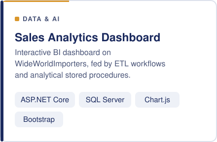
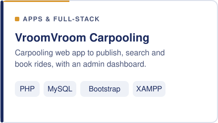
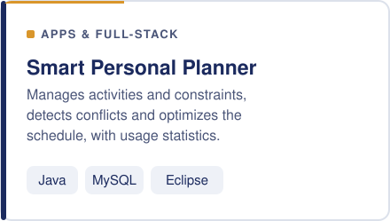
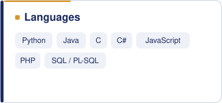
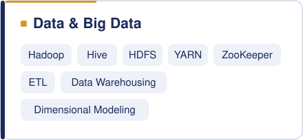
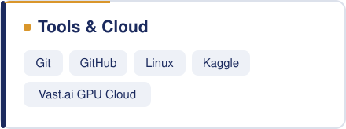

Future engineer in **Data Engineering & Decision Support Systems** at **ENET'COM Sfax**, drawn to problems where raw, messy data has to become something a team can actually decide with.

- 🧱 **Foundations:** data warehousing, ETL, dimensional modeling, and multi-node Hadoop clusters (HDFS, YARN, Hive)
- 🧠 **Applied AI:** 3D deep learning for medical imaging, and AI-assisted metadata analysis for BI
- 🖥️ **Build:** full-stack apps with Angular, NestJS, React, Spring Boot and ASP.NET
- 🔧 **Now:** summer 2026 internship at **DASHMASTER**, building an AI-assisted data warehouse generator
- 🎯 **Next:** a final-year internship in data engineering, BI or AI
- 📫 **Contact:**  [LinkedIn](https://www.linkedin.com/in/kchaou-mariem) &nbsp;·&nbsp;  [kchaoumariem63@gmail.com](mailto:kchaoumariem63@gmail.com)

 

 
 
 
 

 

 
 
 

 

<picture>
  <source media="(prefers-color-scheme: dark)" srcset="https://raw.githubusercontent.com/kchaou-mariem/kchaou-mariem/output/github-snake-dark.svg" />
  <source media="(prefers-color-scheme: light)" srcset="https://raw.githubusercontent.com/kchaou-mariem/kchaou-mariem/output/github-snake.svg" />
  
</picture>

