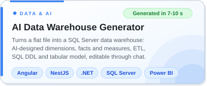
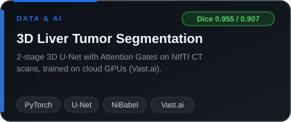
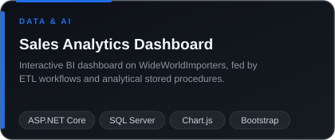
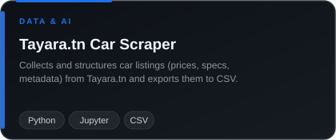
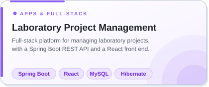
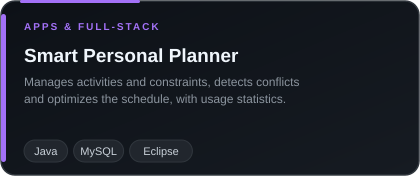

## 👩‍💻 About me

Future engineer in **Data Engineering & Decision Support Systems** at **ENET'COM Sfax**, drawn to problems where raw, messy data has to become something a team can actually decide with.

- 🧱 **Foundations:** data warehousing, ETL, dimensional modeling, and multi-node Hadoop clusters (HDFS, YARN, Hive)
- 🧠 **Applied AI:** 3D deep learning for medical imaging, and AI-assisted metadata analysis for BI
- 🖥️ **Build:** full-stack apps with Angular, NestJS, React, Spring Boot and ASP.NET
- 🔧 **Now:** summer 2026 internship at **DASHMASTER**, building an AI-assisted data warehouse generator
- 🎯 **Next:** a final-year internship in data engineering, BI or AI
- 🏅 **Track record:** admitted directly into 2nd year at ENET'COM (**3rd / 55**), **1st** of the class in my M1 in Data Science & Engineering
- 🌍 **Languages:** Arabic (native), French and English (working proficiency)

## 🚀 Projects

## 🛠️ Skills

**Languages**

**Data & Big Data**

**AI & Deep Learning**

**Databases**

**Full-Stack**

**Tools & Cloud**

## 🐍 Contribution snake

<picture>
  <source media="(prefers-color-scheme: dark)" srcset="https://raw.githubusercontent.com/kchaou-mariem/kchaou-mariem/output/github-snake-dark.svg" />
  <source media="(prefers-color-scheme: light)" srcset="https://raw.githubusercontent.com/kchaou-mariem/kchaou-mariem/output/github-snake.svg" />
  
</picture>

