

<picture><source media="(prefers-color-scheme: dark)" srcset="img/banner-v10-dark.svg"/></picture>

<picture><source media="(prefers-color-scheme: dark)" srcset="img/sec-about-v6-dark.svg"/></picture>

Future engineer in **Data Engineering & Decision Support Systems** at **ENET'COM Sfax**, drawn to problems where raw, messy data has to become something a team can actually decide with.

- 🧱 **Foundations:** data warehousing, ETL, dimensional modeling, and multi-node Hadoop clusters (HDFS, YARN, Hive)
- 🧠 **Applied AI:** 3D deep learning for medical imaging, and AI-assisted metadata analysis for BI
- 🖥️ **Build:** full-stack apps with Angular, NestJS, React, Spring Boot and ASP.NET
- 🔧 **Now:** summer 2026 internship at **DASHMASTER**, building an AI-assisted data warehouse generator
- 🎯 **Next:** a final-year internship in data engineering, BI or AI
- 📫 **Contact:** <a href="https://www.linkedin.com/in/kchaou-mariem"><picture><source media="(prefers-color-scheme: dark)" srcset="img/icon-linkedin-v7-dark.svg"/></picture></a> [LinkedIn](https://www.linkedin.com/in/kchaou-mariem) &nbsp;·&nbsp; <a href="mailto:kchaoumariem63@gmail.com"><picture><source media="(prefers-color-scheme: dark)" srcset="img/icon-email-v7-dark.svg"/></picture></a> [mariem.kchaou@enetcom.u-sfax.tn](mailto:mariem.kchaou@enetcom.u-sfax.tn)

 

<picture><source media="(prefers-color-scheme: dark)" srcset="img/sec-projects-v6-dark.svg"/></picture>

<a href="https://github.com/kchaou-mariem/AI_DW_Generator"><picture><source media="(prefers-color-scheme: dark)" srcset="img/cards/ai-dw-generator-v8-dark.svg"/>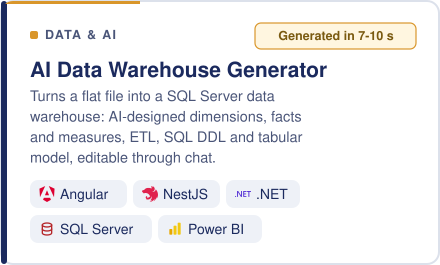</picture></a> <a href="https://github.com/kchaou-mariem/TumorLiverSegmentation"><picture><source media="(prefers-color-scheme: dark)" srcset="img/cards/tumor-liver-segmentation-v8-dark.svg"/>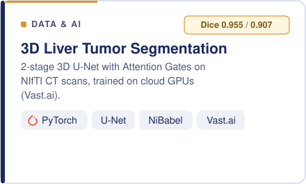</picture></a>
<a href="https://github.com/kchaou-mariem/dashbordSales"><picture><source media="(prefers-color-scheme: dark)" srcset="img/cards/dashbord-sales-v8-dark.svg"/>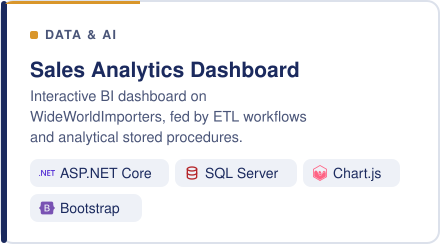</picture></a> <a href="https://github.com/kchaou-mariem/Scrapping_TayaraTN"><picture><source media="(prefers-color-scheme: dark)" srcset="img/cards/scrapping-tayara-tn-v8-dark.svg"/>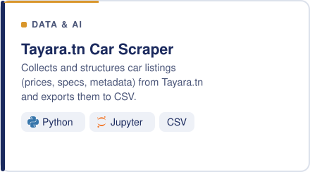</picture></a>
<a href="https://github.com/kchaou-mariem/laboratory-project-management"><picture><source media="(prefers-color-scheme: dark)" srcset="img/cards/laboratory-project-management-v8-dark.svg"/>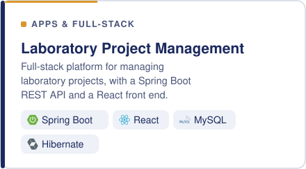</picture></a> <a href="https://github.com/kchaou-mariem/application_covoiturage"><picture><source media="(prefers-color-scheme: dark)" srcset="img/cards/application-covoiturage-v8-dark.svg"/>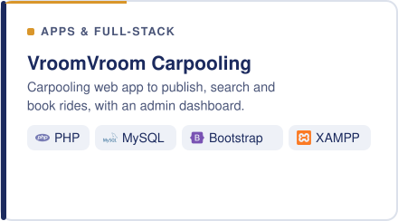</picture></a>
<a href="https://github.com/kchaou-mariem/Planification_personnelle_intelligente"><picture><source media="(prefers-color-scheme: dark)" srcset="img/cards/planification-personnelle-v8-dark.svg"/>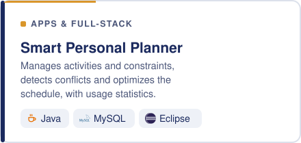</picture></a> <a href="https://github.com/kchaou-mariem/Complexe-Jammoussi---Ticketing-Management-App"><picture><source media="(prefers-color-scheme: dark)" srcset="img/cards/jammoussi-ticketing-v8-dark.svg"/></picture></a>

 

<picture><source media="(prefers-color-scheme: dark)" srcset="img/sec-skills-v6-dark.svg"/></picture>

<picture><source media="(prefers-color-scheme: dark)" srcset="img/skills/languages-v8-dark.svg"/>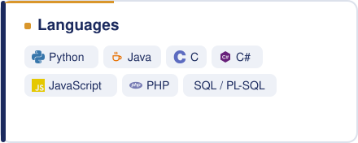</picture> <picture><source media="(prefers-color-scheme: dark)" srcset="img/skills/data-bigdata-v8-dark.svg"/>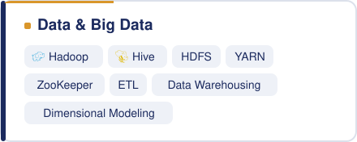</picture>
<picture><source media="(prefers-color-scheme: dark)" srcset="img/skills/ai-deep-learning-v8-dark.svg"/>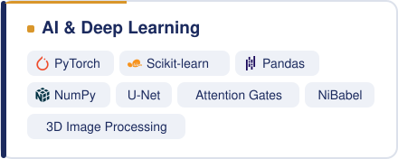</picture> <picture><source media="(prefers-color-scheme: dark)" srcset="img/skills/databases-v8-dark.svg"/>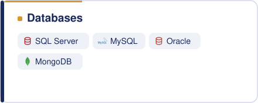</picture>
<picture><source media="(prefers-color-scheme: dark)" srcset="img/skills/full-stack-v8-dark.svg"/>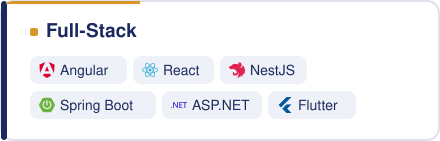</picture> <picture><source media="(prefers-color-scheme: dark)" srcset="img/skills/tools-cloud-v8-dark.svg"/>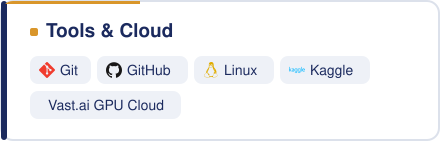</picture>

 

<picture><source media="(prefers-color-scheme: dark)" srcset="img/sec-activity-v6-dark.svg"/></picture>

<picture>
  <source media="(prefers-color-scheme: dark)" srcset="https://raw.githubusercontent.com/kchaou-mariem/kchaou-mariem/output/github-snake-dark.svg" />
  <source media="(prefers-color-scheme: light)" srcset="https://raw.githubusercontent.com/kchaou-mariem/kchaou-mariem/output/github-snake.svg" />
  
</picture>

<picture><source media="(prefers-color-scheme: dark)" srcset="img/outro-v6-dark.svg"/></picture>
